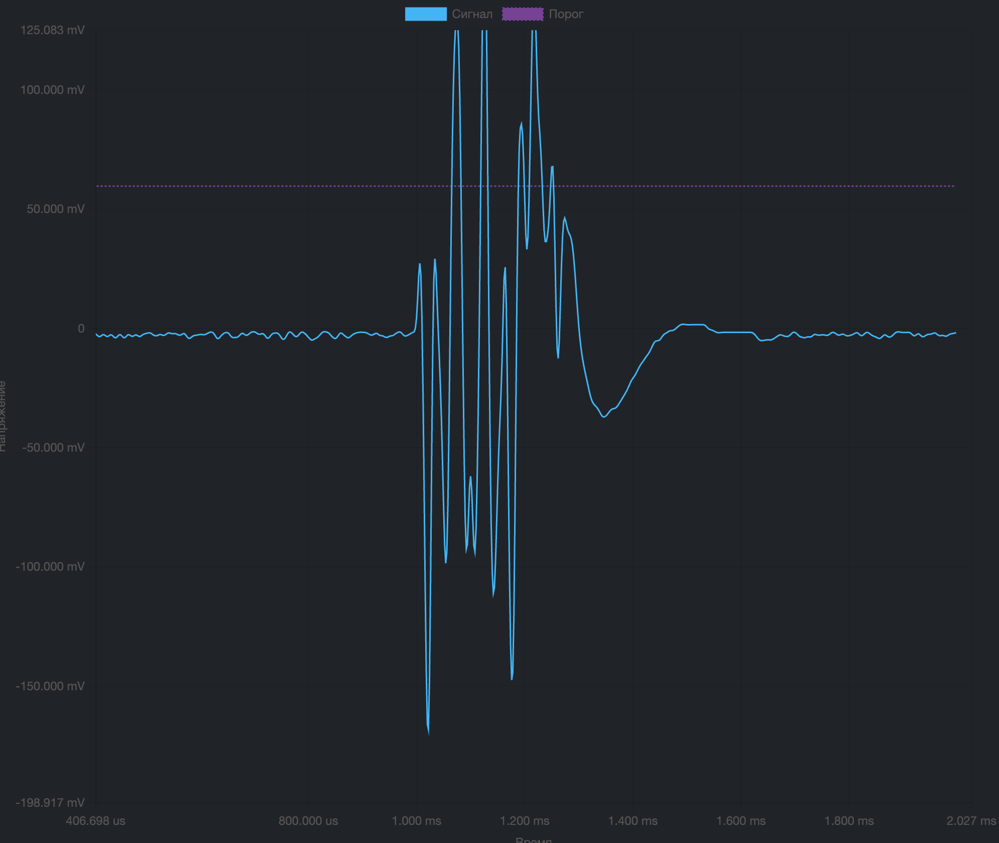
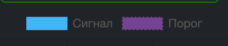

{width=1990px height=1678px}

На графике отображается текущий выбранный сигнал из списка справа. По горизонтали отображается относительное время сигнала (относительно начала сигнала). По вертикали, - напряжение снятое с антенны.

Синий график - это линия сигнала, фиолетовым - порог срабатывания детектора. Это отражено над графиками.

{width=460px height=94px}

Нажав на аннотацию «Сигнал» или «Порог» можно отключить отображение этих графиков

## Управление графиком

### Мышь

-  левая кнопка мыши на графике - перемещение графика

-  вращение колесика на графике - приближение/отдаление графика относительно позиции курсора

### Клавиатура

-  `r` или `к` сбрасывает масштаб и перемещение графика

-  `l` или `д` переключает ФНЧ 48 кГц

### Другое

Нажатие на сигнал в списке сигналов сбрасывает перемещение и масштаб графика