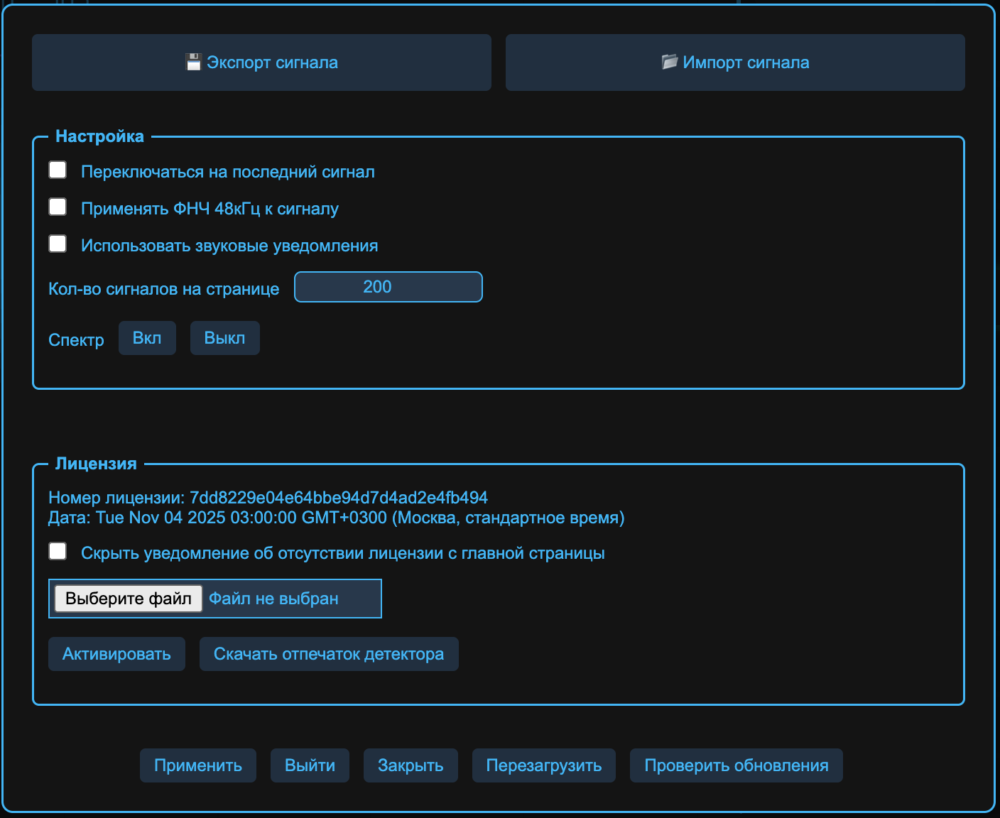
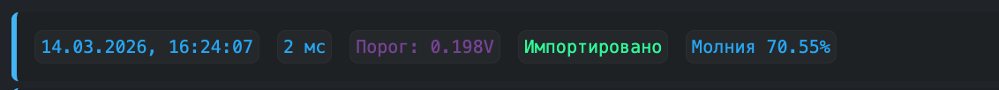

{width=1408px height=1152px}

Меню админ-панели выполняет функцию объединения настроек и переключателей детектора.

## Импорт и экспорт сигнала

В верхней части меню есть кнопки «Импорт и экспорт» и «Экспорт сигнала». При помощи этих кнопок можно сохранить выбранный сигнал и отправить другу или в сообщество. Другой человек может импортировать этот сигнал к себе и посмотреть, что вы поймали.

Импортированный сигнал в списке будет иметь плашку «Импортировано»

{width=1132px height=102px}

## Настройки

В группе «Настройки» собраны переключатели, изменяющие поведение админ-панели или детектора. 

### Переключаться на последний сигнал

Этот параметр позволяет автоматически переключаться на новый сигнал, полученный с детектора

### Применять ФНЧ 48 кГц к сигналу

Эта опция позволяет отображать сигнал после прогона через ФНЧ 48 кГц

### Использовать звуковые уведомления

Воспроизводить звук при получении нового сигнала. Может быть полезно, если хочется заниматься своими делами и при этом фоном мониторить грозовую активность

### Количество сигналов на странице

Данная настройка ограничивает кол-во сигналов в списке принятых. Чтобы длительная работа вкладки не потребляла много ОЗУ

### Спектр

Позволяет включить стриминг сырого сигнала с детектора. Сигнал можно отобразить при помощи отладочной программы просмотра спектра ([Windows](https://repository.thunder-raskat.ru/storage/raskat-spectr.exe)) или написать свой собственный скрипт. 

:::note 

Пока формат передачи данных не задокументирован

:::

## Лицензия

Детектору требуется лицензия, чтобы иметь возможность подключаться к сети раскат и выгружать сигналы. Лицензию можно получить связавшись с нами, написав в Телеграм или на почту

Файл лицензии можно выбрать из диалогового окна, после применения лицензии, вы увидите номер лицензии и дату создания лицензии.

:::info 

Датчик полностью функционирует и без лицензии. Лицензия позволяет подключить детектор в общую сеть грозопеленгации раСкат

:::