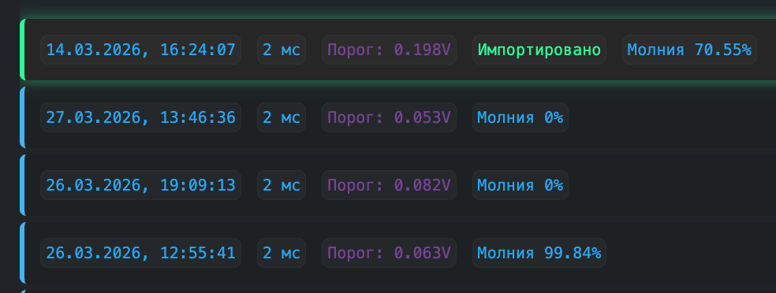

{width=984px height=372px}

В списке сигналов отображаются последние захваченные сигналы. Выбранный сигнал подсвечен зеленой рамкой.

:::note 

Мы не отображаем все сигналы из хранилища, так как подразумевается, что сигналы будут лежать в облаке, и на детекторе достаточно хранить только N последних сигналов.

:::

Для каждого сигнала отображается плашка:

-  Дата начала сигнала

-  Длительность сигнала

-  Порог срабатывания

-  Предсказание нейронной модели

-  Статус загруженного сигнала «Импортировано»